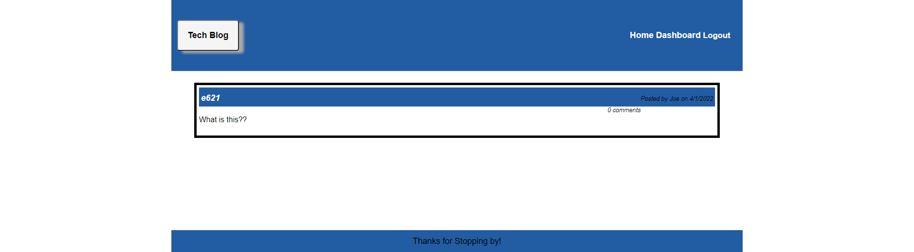

# Tech Blog

## Description

the app allows a user to login sginup add and view comments in a blog setting

## table of Contents

- [Installation](#installation)
- [Usage](#usage)
- [Credits](#credits)
- [License](#license)

## installation

To install the app clone the repo then in the terminal put in.
` npm i , mysql -u root -p , sourcedb/schema.sql, npm start`

## usage
Heroku:https://mvc-techblog14.herokuapp.com/

## license

MIT

## Questions

GitHub: Magicalburritos

Email: hudakjoe@msn.com
